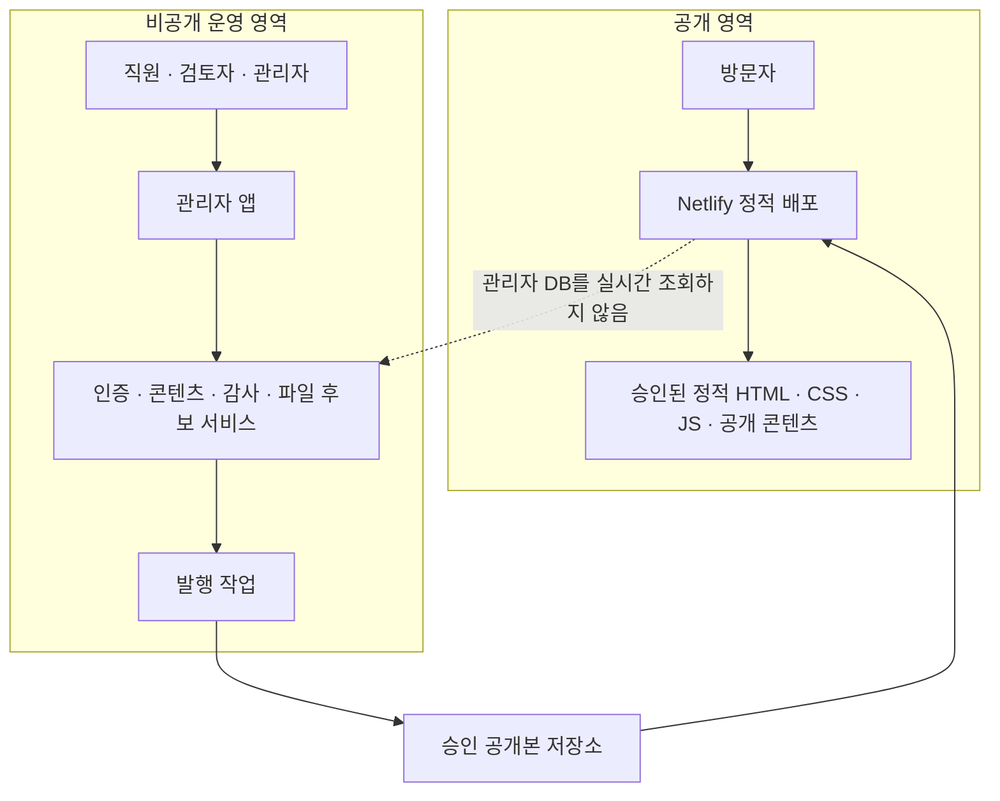
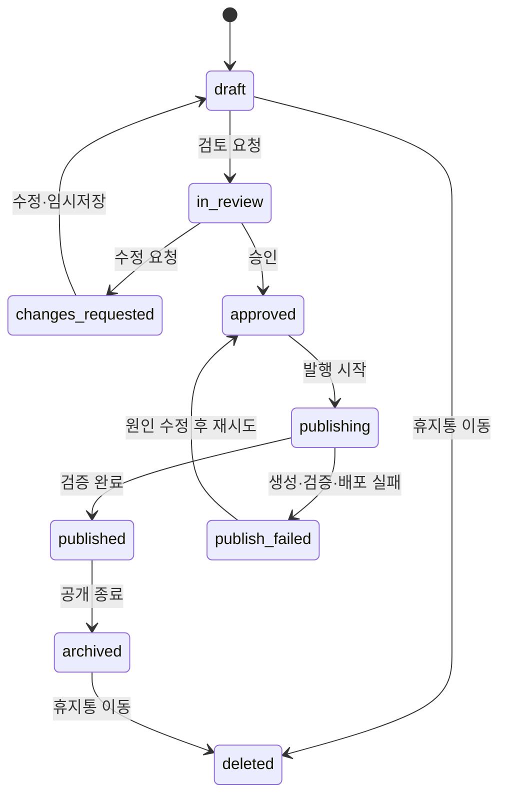
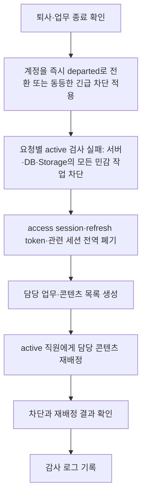

# 관리자 시스템 Phase 0 기술 설계

> 상태: **설계안 — 사용자 승인 전 미확정**
>
> 이 문서는 직원용 관리자 시스템의 Phase 1 구현 전에 결정해야 할 기술·보안·운영 구조를 정리합니다. 관리자 화면, Supabase 프로젝트, 데이터베이스, 로그인, 업로드, GitHub Actions, Netlify 설정 및 공개 홈페이지 코드는 이 문서로 구현하거나 변경하지 않습니다.

## 1. 목적과 범위

태장 홈페이지는 계속 순수 HTML·CSS·JavaScript 정적 사이트로 Netlify에 배포합니다. 직원용 관리자 시스템은 비개발자가 콘텐츠를 작성·검토·승인할 수 있게 하되, 관리자 시스템 또는 후보 백엔드의 장애가 공개 홈페이지를 멈추게 하지 않는 구조를 목표로 합니다.

Phase 0의 산출물은 다음입니다.

- 공개 홈페이지와 관리 영역의 경계, 신뢰 경계, 발행·복구 원칙
- 계정·역할·콘텐츠·감사·파일 관리의 설계 기준
- 정적 발행 후보와 기술 서비스 후보의 비교
- Phase 1 MVP 범위, 위험, 비용 가능성, 사용자 결정 목록

다음은 Phase 0 범위 밖입니다.

- 실제 관리자 UI 또는 `/admin` 구현
- Supabase·Firebase·CMS·DB·Storage·Auth 프로젝트 생성
- 테이블·마이그레이션·RLS·API·토큰·환경변수 실제 설정
- GitHub Actions, Build Hook, Netlify 설정, 외부 서비스 연결
- 공개 HTML·CSS·JavaScript·배포물 수정

## 2. 현재 기준과 설계 원칙

1. 공개 홈페이지는 마지막으로 승인·발행된 정적 파일만 제공한다.
2. 초안, 검토 의견, 내부 메모, 계정 정보, 감사 로그, 원본 파일은 공개 배포물에 포함하지 않는다.
3. 관리자·DB·발행 서비스가 중단되어도 마지막 정상 공개본은 계속 제공한다.
4. 발행은 새 공개본을 완전히 검증한 뒤에만 교체한다. 실패하면 기존 공개본을 유지한다.
5. 공개 홈페이지가 Supabase 등 관리자 데이터베이스를 실시간으로 직접 조회하는 방식은 우선안으로 사용하지 않는다.
6. 직원은 콘텐츠를 관리하되 디자인, 메뉴, 템플릿, 코드, DB 구조, 권한 체계, GitHub·Netlify 설정, 환경변수·비밀키·감사 로그·백업 설정을 수정할 수 없다.
7. 계정 상태와 역할 검사는 화면 숨김이 아니라 서버·데이터·파일 접근 계층에서 강제한다. 상태가 `suspended` 또는 `departed`로 저장되는 순간부터 요청별 `active` 검사가 실패해 민감 작업을 차단해야 하며, 이 차단은 세션 폐기 성공 여부에 의존하지 않는다.
8. 기존 access session과 refresh token의 전역 폐기는 상태 차단과 독립된 추가 방어로 수행한다.
9. Supabase는 우선 검토 후보일 뿐, 이 문서만으로 채택·유료 요금제·외부 연결이 확정되지는 않는다.

## 3. 전체 시스템 구성과 경계

### 공개 홈페이지와 관리자 시스템의 경계

| 구분 | 공개 홈페이지 | 관리자 시스템 |
| --- | --- | --- |
| 접속 대상 | 모든 방문자 | 인증된 업무 담당자 |
| 데이터 | 승인된 공개 필드·공개용 미디어만 | 초안·검토·승인·계정·감사·비공개 원본 |
| 가용성 목표 | 관리자 장애와 독립적으로 마지막 정상본 제공 | 장애 시 콘텐츠 작업·발행만 중단 가능 |
| 권한 | 읽기 전용 | 역할·상태에 따른 최소 권한 |
| 비밀정보 | 없음 | 서버 전용 비밀키·발행 권한은 승인된 비공개 환경에만 |
| 변경 결과 | 승인된 정적 발행으로만 반영 | 초안·검토·승인 기록을 보존 |

### 신뢰·보안 경계

- **인터넷 공개 경계:** 정적 공개 파일만 통과합니다. DB·관리자 API·원본 파일·로그는 통과하지 않습니다.
- **관리자 인증 경계:** 로그인 성공만으로 충분하지 않습니다. 요청마다 계정 상태와 역할을 확인합니다.
- **발행 권한 경계:** 승인된 revision과 공개 allowlist를 만족하는 발행 작업만 공개 결과물을 만들 수 있습니다.
- **비밀키 경계:** GitHub 쓰기 토큰, 서버 전용 키, Build Hook, Storage 관리 권한은 브라우저·정적 JS·공개 저장소·감사 로그에 넣지 않습니다.
- **원본 파일 경계:** 원본과 검토용 파일은 제한 저장소에 두며, 웹용 파생본·공개 PDF만 승인 후 공개 영역으로 보냅니다.

## 4. 콘텐츠 상태와 업무 흐름

### 콘텐츠 상태 모델

| 상태 | 의미 | 공개 배포 포함 | 대표 다음 상태 |
| --- | --- | --- | --- |
| `draft` | 작성 중 또는 임시저장 | 아니오 | `in_review` |
| `in_review` | 검토 요청됨 | 아니오 | `changes_requested`, `approved` |
| `changes_requested` | 수정 요청됨 | 아니오 | `draft` 또는 `in_review` |
| `approved` | 특정 revision이 공개 승인됨 | 발행 전까지 아니오 | `publishing` |
| `publishing` | 승인본의 정적 발행 작업 중 | 아니오 | `published`, `publish_failed` |
| `published` | 승인본이 정상 공개됨 | 예 | `archived` 또는 새 revision 작성 |
| `publish_failed` | 새 공개본 발행 실패 | 아니오; 기존 공개본 유지 | `approved` 재발행 |
| `archived` | 공개 종료·보존 상태 | 아니오 | 필요 시 새 revision |
| `deleted` | 콘텐츠 soft delete·휴지통 | 아니오 | 복원 또는 보존 만료 후 별도 절차 |

콘텐츠의 `deleted`는 계정 상태 `deleted`와 다른 개념입니다. 계정이 `departed`가 되어도 그 사람이 작성·검토·승인한 콘텐츠와 revision은 보존합니다.

### 작성부터 발행까지

1. 작성자는 허용된 콘텐츠 유형을 만들고 `draft`로 임시저장합니다.
2. 작성자는 사실 확인 근거·공개 승인 상태·검토 요청 사유를 남기고 `in_review`로 전환합니다.
3. 검토자는 revision 단위로 수정 요청 또는 승인(또는 승인 권고)을 기록합니다.
4. 승인 권한자는 승인 대상 revision을 명확히 고정합니다. 승인 뒤 수정되면 새 revision은 다시 검토합니다.
5. 발행 담당 또는 승인된 서버 작업은 **승인된 동일 revision**만 읽어 공개 allowlist에 맞는 JSON·HTML·공개 파일 목록을 생성합니다.
6. 생성 결과의 형식·링크·비공개 필드 제외 여부를 확인한 뒤에만 공개본을 교체합니다.
7. 실패하면 `publish_failed`를 기록하되 기존 공개본·기존 URL·기존 Netlify 배포는 건드리지 않습니다.
8. 발행, 실패, 롤백, 공개 종료는 모두 감사 로그에 대상 revision과 결과를 남깁니다.

## 5. 정적 발행 방식 후보

| 후보 | 방식 | 안정성·장애 분리 | 보안·감사 | 복잡도·운영 | 롤백·비용·종속성 |
| --- | --- | --- | --- | --- | --- |
| A | 관리자 시스템이 승인 콘텐츠를 정적 JSON 또는 HTML로 만들고 전용 발행 브랜치 또는 별도 콘텐츠 저장소에 커밋, 승인된 절차로 Netlify가 배포 | 높음. 공개 사이트는 정적본만 사용 | 커밋 이력과 승인 로그를 함께 남길 수 있음. 관리자에 GitHub 쓰기 권한 보호가 핵심 | 중간. 발행 권한을 서버에만 두어야 함 | Git revert·이전 commit으로 명확. GitHub·Netlify 종속, 일반 정적 배포 비용은 낮음 |
| B | 별도 GitHub Actions가 승인 데이터를 읽어 정적 파일 생성·배포 | 높음. 작업 실패 시 기존 배포 유지 가능 | 실행 권한·비밀값·승인 검증을 안전하게 설계해야 함 | 중상. Actions·Secrets·실패 재시도 관리 필요 | commit·artifact 기준 롤백 가능. Actions 사용량·운영 이해 필요 |
| C | 분리 발행 서비스 또는 Netlify Build Hook으로 빌드 | 조건부 높음. 공개본은 정적이나 외부 발행 서비스 의존 | Hook URL·서버 키 유출 방지와 요청 검증 필요 | 중상~높음. 서비스·배포 경로가 늘어남 | 이전 배포 전환은 가능하나 서비스·유료 플랜 영향 확인 필요 |
| D | 공개 홈페이지가 Supabase를 실시간 직접 조회 | 낮음. DB·Auth·네트워크 장애가 방문자 화면에 영향 | 공개 읽기 정책·데이터 노출 위험이 커짐 | 초기 화면 구현은 쉬울 수 있으나 운영 복잡도 증가 | DB 장애 시 페이지 데이터가 사라질 수 있음. 서비스 종속성 큼 |

### Phase 1 권장 발행 방식 — **승인 전 제안**

**후보 A를 우선 설계안으로 검토**합니다. 관리자 앱의 서버 측 발행 구성요소가 승인 revision에서 공개 JSON 또는 정적 콘텐츠를 만들고, **전용 발행 브랜치 또는 별도 콘텐츠 저장소**에 커밋한 뒤 승인된 Netlify 정적 배포 흐름을 이용하는 방식입니다. 보호된 `main`에 관리자 시스템이 직접 쓰는 구조는 우선안으로 사용하지 않습니다.

권장 이유는 다음과 같습니다.

- 공개 홈페이지가 관리자 DB를 호출하지 않아 장애가 분리됩니다.
- 공개 결과물, 발행 시점, 변경 diff를 Git 이력으로 확인·롤백하기 쉽습니다.
- 현재 정적 사이트·Netlify 구조를 크게 바꾸지 않습니다.
- Phase 1에서 GitHub Actions와 Build Hook을 한꺼번에 도입하지 않아도 됩니다.
- 자동 발행 권한을 관리자 앱의 서버 측에만 두고, 직원에게 GitHub 쓰기 권한이나 Netlify 운영 권한을 직접 부여하지 않습니다.
- `main` 반영·자동 병합·Netlify 운영 배포는 발행 작업과 별도로 승인 및 보호 규칙을 통과하게 할 수 있습니다.

긴급 정정도 감사 로그, 승인된 공개 범위 검증, 실패 시 기존 공개본 유지, 롤백 절차를 우회하지 않습니다.

다만 아래 결정 전에는 확정하지 않습니다.

- 관리자 시스템의 GitHub 서버 권한 보관 방식
- 전용 발행 브랜치와 별도 콘텐츠 저장소 중 선택
- 발행 결과를 사람이 검토하는 PR로 둘지, 별도 승인된 자동 반영 규칙을 둘지
- `main` 반영, 자동 병합, Netlify 운영 배포에 필요한 보호 규칙과 승인자
- 일반 발행 빈도와 긴급 정정 절차
- Netlify 배포·Preview 사용량과 비용 한도

## 6. 발행 실패, 기존 공개본 유지, 롤백

### 실패 시 기존 공개본 유지

발행은 원자적 교체 원칙을 사용합니다.

1. 승인 revision을 고정하고 공개 가능한 필드·파일만 추출합니다.
2. 임시 결과물에서 JSON 문법, 필수 필드, 내부 링크, 파일 존재, 비공개 필드 제외 여부를 검사합니다.
3. 검사 실패, GitHub 쓰기 실패, 배포 실패, 결과 확인 실패 중 하나라도 있으면 새 공개본을 활성화하지 않습니다.
4. 공개 사이트는 이전 성공 commit과 Netlify의 마지막 정상 배포를 계속 제공합니다.
5. 관리자에는 실패 원인·대상 revision·재시도 가능 여부를 표시하고 감사 로그에 남깁니다. 비밀값이나 민감 원문은 오류 로그에 남기지 않습니다.

### 롤백 방식

- **공개 정적본 롤백:** 마지막 정상 발행 commit 또는 Netlify의 이전 정상 배포로 되돌립니다.
- **콘텐츠 롤백:** 기존 `published_revision`을 새 승인 없이 임의 변경하지 않고, 어떤 revision을 다시 공개할지 권한 있는 승인자가 기록합니다.
- **파일 롤백:** 기존 공개 파일은 새 파일 발행이 완전히 성공한 뒤에만 교체합니다. 참조 중인 파일은 즉시 삭제하지 않습니다.
- **데이터 롤백:** DB 복구는 공개 사이트 롤백과 별도 절차로 다룹니다. DB가 중단돼도 공개 정적본은 유지됩니다.
- **사고 기록:** 롤백 사유, 처리자, 이전·이후 공개 revision, 영향 범위, 확인 결과를 감사 로그에 남깁니다.

### 관리자 또는 후보 백엔드 장애 시 공개 홈페이지

| 상황 | 공개 홈페이지 | 관리자 작업 |
| --- | --- | --- |
| 관리자 UI 장애 | 마지막 정적본 정상 제공 | 작성·검토·발행 중단 또는 지연 |
| Supabase 등 DB/Auth 장애 | 마지막 정적본 정상 제공 | 로그인·저장·검토·발행 불가 |
| Storage 장애 | 기존 공개 파일은 CDN·정적본 기준 계속 제공 | 새 업로드·교체 중단 |
| 발행 서비스/GitHub 장애 | 마지막 정적본 정상 제공 | 새 발행 대기·실패 기록 |
| Netlify 장애 | 정적 호스팅 서비스 영향 가능 | 관리자와 무관한 별도 장애 대응 필요 |

## 7. 인증, 역할, 권한

### 인증 구조

- 관리형 인증을 우선 검토하되, 실제 공급자는 사용자 승인 후 확정합니다.
- Phase 1 기본 로그인은 업무용 이메일과 개별 계정을 권장합니다. 공용 계정은 금지합니다.
- 인증 성공 후에도 모든 관리자 API·DB·Storage 요청은 계정 상태 `active`와 역할을 다시 검사합니다.
- 최고관리자 중요 작업은 재인증·확인 절차를 둡니다.
- 비밀번호·토큰은 직접 저장하거나 감사 로그에 기록하지 않습니다.
- MFA는 최소 최고관리자와 개발·복구 권한자 우선 도입 후보이며, 서비스 선택·비용과 함께 승인받습니다.

### 역할 후보

| 역할 | 허용 업무 | 금지 또는 별도 승인 |
| --- | --- | --- |
| `staff` 또는 `author` | 콘텐츠 작성, 임시저장, 본인에게 허용된 수정, 검토 요청 | 승인·발행, 계정 상태·역할 변경, 설정·코드·파일 공개 전환 |
| `reviewer` | 검토, 수정 요청, 승인 또는 승인 권고 | 권한·계정 상태·배포 설정 변경 |
| `admin` | 콘텐츠 운영 관리, 직원 계정 관리, 담당자 배정, `suspended`·`departed` 처리 | 마지막 최고관리자 보호를 우회하는 변경, 시스템 비밀키·배포 설정 변경 |
| `super_admin` | 역할·관리자 임명, 중요 계정 처리, 백업·복구 관리, 중요 보안·발행 구조 관리 | 공개 코드·DB 구조·Netlify 설정을 직원용 UI에서 직접 수정 |

소수 인원은 역할 겸임이 가능할 수 있으나, 최소한 작성자와 최종 공개 승인자를 분리하는 2인 확인을 권장합니다. 승인자가 실제로 무엇을 승인할 수 있는지(승인 권고와 최종 승인 구분)는 사용자 결정 사항입니다.

## 8. 계정 상태와 퇴사자 처리

### 계정 상태

| 상태 | 로그인 | 기존 세션·토큰 | 콘텐츠·검토·발행 | 업로드 | 기록 보존 |
| --- | --- | --- | --- | --- | --- |
| `active` | 허용 | 정상 정책 적용 | 역할 범위에서 허용 | 역할 범위에서 허용 | 보존 |
| `suspended` | 차단 | 즉시 무효화 | 전부 차단 | 전부 차단 | 보존 |
| `departed` | 차단 | 즉시 무효화 | 전부 차단 | 전부 차단 | 보존 |
| `deleted` | 차단 | 무효화 | 전부 차단 | 전부 차단 | 개인정보는 법률·승인에 따라 익명화 가능하나 업무 행위 이력·revision·감사 로그는 참조 보존 |

- 일반 퇴사는 반드시 `departed`입니다. `deleted`는 일반 퇴사용으로 사용하지 않습니다.
- 계정이 `deleted` 또는 익명화되어도 과거 콘텐츠 revision과 감사 로그는 유지합니다. 작성자·검토자·승인자 관계가 끊기지 않도록 tombstone, 별도 보존 레코드 또는 동등한 참조 보존 방식을 사용합니다.
- 법적 개인정보 삭제가 필요한 경우 표시명과 개인정보는 익명화할 수 있으나, 업무 행위 이력은 최소 식별자로 보존합니다. 감사 로그는 계정 삭제와 함께 삭제하지 않습니다.
- 실제 물리 삭제 허용 범위는 법률·개인정보 검토와 별도 사용자 승인 후에만 정합니다.
- 일반 직원은 자신의 상태나 다른 사람의 상태를 변경할 수 없습니다.
- `suspended`와 `departed` 처리는 권한 있는 관리자만 할 수 있습니다.
- 상태 변경 사유는 건강·징계 등 민감한 인사정보가 아닌 필요한 최소 업무상 표현으로 기록합니다.

### 퇴사 처리 흐름

### 기존 세션 무효화 방식

세부 API는 선택한 인증 서비스의 공식 문서를 확인한 뒤 확정하지만, Phase 1은 **독립된 두 방어**를 보장해야 합니다.

1. **요청별 상태 차단:** `suspended` 또는 `departed` 상태가 저장되는 순간부터 서버·DB·Storage의 모든 민감 요청은 `active` 검사에 실패하여 저장·수정·삭제·검토·승인·발행·업로드를 거부합니다. 상태 변경과 동시에 진행 중인 요청, 오래 열린 브라우저, 재사용 access token도 이 검사에서 거부되어야 합니다.
2. **세션 전역 폐기:** 기존 access session, refresh token 및 관련 세션을 서버 측에서 전역 무효화합니다. 이는 추가 방어이며, 세션 폐기가 늦거나 일부 실패해도 1번 상태 차단의 효력은 약화되거나 지연되지 않습니다.
3. 클라이언트는 로그인 화면으로 이동하되, UI 이동 실패 여부와 관계없이 서버·DB·Storage가 거부합니다.
4. 복구는 기존 세션을 되살리지 않고, 역할과 상태를 재확인한 뒤 새 로그인으로 시작합니다.
5. 세션 무효화 성공·실패와 `departed` 처리 후 차단 확인을 감사 로그에 남깁니다.

### 마지막 active 최고관리자 보호

마지막 `active` `super_admin`은 정지·퇴사·삭제·역할 강등 대상이 될 수 없습니다. 이 규칙은 화면 버튼 비활성화만으로 충분하지 않습니다.

- 서버의 상태·역할 변경 명령은 변경 전후 `active super_admin` 수를 원자적으로 검사합니다.
- DB 제약 또는 트랜잭션 정책도 마지막 1명을 0명으로 만드는 변경을 거부해야 합니다.
- 본인 자신에 대한 강등·비활성화와 다른 관리자의 마지막 최고관리자 비활성화 모두 막아야 합니다.
- 예외적인 복구·조직 변경은 최소 두 명의 권한자 또는 별도 비상 절차를 사용자 승인 후 설계합니다.
- 거부된 시도도 감사 로그에 기록합니다.

### 담당 콘텐츠 재배정

- 재배정은 현재 `assignee`만 바꾸고, 원 작성자·검토자·승인자·revision 관계는 수정하지 않습니다.
- 대상은 초안, 검토 요청, 수정 요청, 예약 발행 후보, 미처리 공개 오류, 비공개 원본 검토 책임을 포함합니다.
- 새 담당자는 `active` 계정이어야 하며 역할 적합성을 검사합니다.
- 재배정 실패나 지연은 퇴사자 접근 차단을 지연시키지 않습니다. 계정 상태 차단과 세션 폐기를 먼저 적용하고, 관리자에게 즉시 미배정 업무를 경고하며 후속 재배정 책임자와 기한을 기록합니다.

## 9. 감사 로그, 파일, 개인정보

### 감사 로그 구조

감사 로그는 콘텐츠 revision과 별도이며 변경·복구의 추적을 위한 append-only 기록을 지향합니다.

| 필드 | 예시·원칙 |
| --- | --- |
| `occurred_at` | 서버 기준 시각 |
| `actor_id`, `actor_role` | 행위자와 당시 역할 |
| `action` | 로그인, 작성, 상태변경, 승인, 발행, 롤백, 재배정 등 |
| `target_type`, `target_id` | 계정, 콘텐츠, revision, 파일, 발행 작업 |
| `before_summary`, `after_summary` | 필요한 최소 변경 요약 |
| `reason` | 계정 상태·롤백의 최소 업무상 사유 |
| `result`, `correlation_id` | 성공·거부·실패와 관련 작업 묶음 |
| `session_reference` | 노출 가능한 최소 세션 참조; 토큰 원문 금지 |

필수 보안 이벤트는 로그인 실패, 권한 거부, 계정 상태 변경 성공·실패, 세션 무효화 성공·실패, `departed` 처리 후 차단 확인, 마지막 active 최고관리자 변경 거부, 재배정 실패와 미배정 업무 발생, 발행 검증 실패, 롤백 승인과 실행 결과를 포함합니다.

로그에는 비밀번호, access token, refresh token, 비밀키, 동의서 원문, 계약 원문, 민감한 인사 사유 및 민감한 본문 전문을 저장하지 않습니다. 보존 기간과 로그 열람자는 사용자 결정 사항입니다.

### 파일 업로드와 공개 파일 관리

- 업로드는 `active` 계정과 역할 검사를 모두 통과한 경우에만 허용합니다.
- 허용 확장자, MIME, 파일 시그니처, 크기, 이미지 픽셀, 파일명 안전성을 서버에서 검사합니다.
- HTML·스크립트·실행 파일과 위험한 SVG 등은 차단합니다.
- PDF·이미지는 악성 파일·개인정보·승인 상태 확인 전 공개하지 않습니다.
- 공개 파일 URL의 읽기 권한과 수정·삭제 권한을 분리합니다.
- `suspended`·`departed`는 업로드·교체·삭제를 모두 할 수 없지만 기존 파일을 자동 삭제하지 않습니다.

### 원본 파일과 공개 파일 분리

| 영역 | 내용 | 접근 |
| --- | --- | --- |
| 제한 원본 | 원본 사진, 검토용 문서, 동의 참조, 내부 메타데이터 | 역할·상태 기반 제한 |
| 웹 파생본 | 메타데이터 제거·크기 최적화한 이미지 | 승인 후 발행 절차만 공개 영역으로 이동 |
| 공개 파일 | 승인된 PDF, 이미지, 정적 콘텐츠 참조 파일 | 방문자 읽기 가능, 직접 수정 불가 |

원본 파일의 공개 승인 여부, 제공자, 확인일, 사용 범위는 내부 메타데이터로 관리합니다. 동의서 원본은 관리자 콘텐츠 DB가 아니라 별도 제한 보관소에 두고, 시스템에는 확인 상태·확인자·일자·참조번호만 남기는 방식을 권장합니다.

### 개인정보 최소 수집

- 직원 계정에는 업무용 이메일, 이름 또는 표시명, 역할, 상태, 발급·변경 기록 등 필요한 최소 정보만 둡니다.
- 주민등록번호, 장애·건강정보, 개인 연락처, 고객사 계약 원문, 인사 상세 사유는 콘텐츠 관리자 DB에 저장하지 않습니다.
- 공개 출력에는 작성자 내부 ID, 검토 의견, 원본 경로, 계정 상태, 감사 로그를 포함하지 않습니다.
- 개인정보 처리 목적·보유 기간·파기·정보주체 요청 처리 방식은 실제 도입 전에 사용자와 법률·노무 담당자가 확정해야 합니다.

## 10. 백업, 복구, 비밀값

### 백업과 복구 원칙

- 콘텐츠 DB 자동 백업, 정기 논리 내보내기, 중요 원본·파일 목록 백업, 마지막 정상 정적 발행본을 분리합니다.
- 백업은 운영 데이터와 동일하거나 더 강한 접근 통제·암호화·보존 정책을 적용합니다.
- 최소 분기별로 콘텐츠, 공개 파일, 권한, 감사 로그 복구 시나리오를 시험하고 결과를 기록하는 방안을 권장합니다.
- 복구 시험은 운영 개인정보를 불필요하게 복제하지 않는 환경에서 합니다.
- 백업 서비스·보존 기간·복구 책임자·복구 목표 시간은 사용자 승인 사항입니다.

### 비밀키·환경변수 관리

- 값은 저장소, 공개 문서, 브라우저 번들, 화면 캡처, 오류 로그에 넣지 않습니다.
- 필요한 경우 환경변수는 개발·Preview·운영을 분리하고 이름·용도만 문서화합니다.
- 서버 전용 키, GitHub 쓰기 권한, Build Hook, 이메일 서비스 키는 최소 권한·정기 회전·접근 기록 원칙을 적용합니다.
- 퇴사, 공급자 변경, 유출 의심 시 관련 키 회전 절차가 필요합니다.
- 실제 어떤 비밀 저장소를 쓸지와 유료 플랜은 Phase 0 승인 전에는 결정하지 않습니다.

## 11. 기술 서비스 후보 비교

| 후보 | 인증·권한·세션 차단 | DB·파일·감사 | 정적 발행 적합성 | 비용·종속성·난이도 |
| --- | --- | --- | --- | --- |
| Supabase | Auth·RLS·관리 API를 한 플랫폼에서 검토 가능. 세션 차단 방식은 공식 문서 검증 필요 | Postgres·Storage 기반으로 설계 가능 | 서버 측 승인 발행과 조합하기 좋음 | 우선 후보. 유료 전환·백업·벤더 종속성 검토 필요 |
| Firebase | Auth·Firestore·Storage 제공. 복잡 권한은 규칙 설계 필요 | 문서형 DB 특성과 감사·revision 설계를 별도 검토 | 정적 발행 가능 | 익숙한 생태계이나 데이터 모델·비용 예측·종속성 비교 필요 |
| Git 기반 CMS | Git 이력·PR 중심 검토가 쉬움 | 계정·세션 회수·파일·감사·복잡 역할은 별도 보강 필요 | 매우 적합 | 비개발자 UX와 권한·퇴사 관리가 제약될 수 있음 |
| 헤드리스 CMS | 관리자 UI·콘텐츠 모델 제공 가능 | 공급자별 권한·로그·파일 기능 차이 큼 | webhook 또는 빌드로 가능 | 월 비용·벤더 종속성·보안 검토 필요 |
| Netlify Functions + 외부 DB | 구성 자유도 높음 | Auth·RLS·Storage·감사·복구를 조합 구현해야 함 | 가능 | 개발·운영 난이도와 비밀 관리 증가 |
| 자체 서버·자체 DB | 요구 맞춤 가능 | 모든 인증·백업·보안·장애 대응 책임을 내부가 가짐 | 가능 | 초기·상시 운영 부담이 큼; Phase 1 비권장 |
| GitHub 수동 운영 유지 | GitHub 계정 권한에 의존 | 콘텐츠 이력은 남지만 직원 계정·세션·파일·감사 요구 충족 어려움 | 현재 정적 구조와 동일 | 비용은 낮으나 Phase 1 목표에는 부적합 |

### 기술 방향 제안 — **승인 전**

Phase 1 후보로는 **Supabase 기반 비공개 관리자 + 승인 콘텐츠의 정적 발행**을 우선 상세 검토합니다. 이유는 관계형 콘텐츠·revision·감사·계정 상태·파일 메타데이터 모델에 적합할 가능성이 높고, 공개 사이트를 정적본으로 분리할 수 있기 때문입니다.

그러나 이는 최종 채택 결정이 아닙니다. 특히 다음을 공식 문서·소규모 비운영 검증으로 확인한 뒤 사용자 승인을 받아야 합니다.

- `suspended`·`departed`의 즉시 로그인·세션·API·RLS·Storage 차단 가능 범위
- 마지막 최고관리자 보호를 서버·DB 수준에서 만들 수 있는 방식
- 백업·복구·감사 로그·Storage 비용
- 한국어 운영자에게 맞는 관리자 UX와 계정 발급 절차
- GitHub 정적 발행 권한과 Netlify 배포 흐름의 안전한 연결 방식

## 12. Phase 1 MVP 권장 범위

### 포함

- 관리자 로그인과 역할별 접근 통제
- 개별 직원 계정 생성, `active`·`suspended`·`departed`·`deleted` 상태 모델
- `suspended`·`departed` 시 로그인·기존 세션·작성·수정·삭제·검토·승인·발행·업로드 차단
- 마지막 active 최고관리자 보호
- 담당 콘텐츠 재배정과 원 작성자·revision·감사 기록 보존
- 공지·우리의 일터·태장의 활동 등 우선 콘텐츠의 작성, 임시저장, 검토 요청, 수정 요청, 승인
- 승인 revision의 정적 발행, 발행 실패 시 기존 공개본 유지, 기본 롤백 절차
- 기본 파일 업로드 보안과 원본·공개 파일 분리
- 계정·콘텐츠·승인·발행·롤백의 감사 로그
- 최소 백업·복구 절차와 운영자 매뉴얼

### Phase 1 이후 후보

- 복잡한 통계·월간 보고 자동화
- 다국어
- AI 작성·검수 기능
- 네이티브 모바일 앱
- 고급 예약 발행·대규모 캠페인
- 보도자료·채용·회사소개서 PDF·자료실 전체 기능 확장
- 문의 접수 CRM·외부 업무 시스템 연계
- 고급 미디어 변환·중복 탐지·자동 얼굴·문서 분석
- 예외적 영구삭제 프로세스와 장기 보존 자동화

## 13. 주요 위험과 대응

| 위험 | 영향 | 대응 원칙 |
| --- | --- | --- |
| 관리자/DB 장애가 공개 사이트로 전파 | 대외 신뢰 저하 | 공개 사이트는 정적 승인본만 사용 |
| 미승인 초안 또는 내부 메모 공개 | 개인정보·대외 표현 사고 | revision 승인·발행 allowlist·공개/비공개 파일 분리 |
| 퇴사자 세션이 남음 | 무단 수정·업로드 | 상태 전환 즉시 서버 측 세션 무효화와 요청별 active 검사 |
| 권한을 UI만으로 제한 | API 직접 호출 우회 | 서버·DB·Storage 정책에서 최소 권한 강제 |
| 마지막 최고관리자 상실 | 계정 복구 불가 | 서버·DB 트랜잭션 수준 보호와 비상 절차 |
| GitHub/발행 권한 키 유출 | 공개 사이트 변조 | 서버 전용 보관·최소 권한·회전·로그 마스킹 |
| 업로드 파일의 악성·개인정보 노출 | 보안·법적 문제 | 형식·시그니처·용량 검사, 사람 검토, 원본 비공개 |
| 롤백 불명확 | 장애 장기화 | 정상 공개본·revision·발행 commit·복구 절차 분리 기록 |
| 유료 플랜·배포 사용량 증가 | 예산 초과 | 발행 빈도·Preview·백업·서비스별 비용을 승인 전 산정 |
| 소수 인력의 승인 분리 어려움 | 오류·권한 남용 | 겸임 허용 범위와 긴급 예외를 문서로 승인 |

## 14. 사용자 승인이 필요한 미결정 사항

| 항목 | 선택지 | 권장안 | 비용 또는 위험 | 승인 시점 |
| --- | --- | --- | --- | --- |
| 백엔드 | Supabase / Firebase / CMS / 기타 | Supabase 우선 검토 | 월 요금·벤더 종속성·세션 차단 검증 | Phase 1 착수 전 |
| 관리자 앱 배포 위치 | 별도 호스팅 / 동일 도메인 분리 / 기타 | 공개 사이트와 접근·배포 경계 분리 | 운영·인증·도메인 영향 | 구현 설계 전 |
| 정적 발행 방식 | A 직접 커밋 / B Actions / C 발행 서비스 / D 실시간 조회 | A 우선 검토 | GitHub 권한·배포 사용량·운영 절차 | 구현 설계 전 |
| GitHub 저장소 | 기존 저장소 직접 커밋 / 별도 콘텐츠 저장소 | 기존 구조 유지 가능성을 먼저 검토 | 권한 분리·PR 흐름·롤백 차이 | 발행 설계 전 |
| GitHub Actions | 사용 / 미사용 | Phase 1은 미사용 가능성 우선 검토 | Secrets·운영 복잡도·사용량 | 발행 방식 확정 시 |
| Netlify Build Hook | 사용 / 미사용 | 먼저 미사용으로 단순화 검토 | Hook 보안·서비스 종속성 | 발행 방식 확정 시 |
| 파일 저장소 | Supabase Storage / 다른 관리형 Storage / 내부 보관 | 원본 제한 보관·공개본 분리 | 용량·권한·비용 | 업로드 구현 전 |
| 백업 | 공급자 백업 / 별도 내보내기 / 혼합 | DB·파일·정적본 분리 백업 | 복구 비용·보존 의무 | 운영 전 |
| 유료 요금제 | 무료 범위 / 유료 전환 | 실제 사용량 산정 후 승인 | 예산·기능 제한 | 서비스 도입 전 |
| 개인정보 범위 | 최소 계정 정보 / 추가 운영 정보 | 최소 수집 | 법률·보관·동의 책임 | 데이터 모델 확정 전 |
| 감사 로그 보존 | 6개월 / 1년 / 별도 | 1년 검토 후 확정 | 저장 비용·열람권한 | 운영 전 |
| 승인자 분리 | 1단계 / 검토+최종승인 | 작성·최종공개 2인 확인 | 소수 인력 부담 | MVP 화면·권한 전 |
| 예약 발행 | MVP / Phase 2 | Phase 2 | 재배정·세션·검증 복잡도 | MVP 범위 확정 시 |

## 15. Phase 1 착수 전 확인 목록

- [ ] 백엔드와 관리형 인증 후보의 공식 문서·비용·장애 정책 검토
- [ ] 상태 변경 시 세션·refresh token·API·RLS·Storage 차단의 실제 구현 가능성 확인
- [ ] `active`·`suspended`·`departed`·`deleted` 상태 전환 표와 권한 매트릭스 승인
- [ ] 마지막 active 최고관리자 보호의 서버·DB 검증 방식 확정
- [ ] 콘텐츠 유형, revision, 승인 권한, 공개 allowlist 확정
- [ ] 발행 방식·저장소 구조·GitHub 권한·Netlify 배포 영향 승인
- [ ] 원본·웹본·공개 파일 저장 위치와 공개 승인 절차 확정
- [ ] 개인정보 최소 수집, 동의서 원본 보관, 감사 로그 보존 기간 결정
- [ ] 백업·복구 책임자, 복구 목표, 정기 복구 시험 기준 결정
- [ ] 개발·Preview·운영 환경 분리와 비밀값 관리 방식 결정
- [ ] 월 예상 비용과 사용량 경보 기준 검토
- [ ] Phase 1 운영 책임자(콘텐츠·검토·최종 승인·계정·복구) 지정
- [ ] 직원 매뉴얼·퇴사 체크리스트·긴급 차단 절차 초안 검토

## 16. Phase 1 첫 구현 권장 작업

사용자 승인 후 가장 먼저 할 일은 실제 화면 개발이 아니라, 선택한 후보 서비스의 **비운영 테스트 환경**에서 다음 보안 핵심 시나리오를 작게 검증하는 것입니다.

1. 개별 계정·역할·상태 모델과 요청별 `active` 검사를 구현합니다.
2. `suspended`와 `departed` 처리 시 기존 세션 무효화, DB 변경 거부, Storage 업로드 거부를 자동 테스트합니다.
3. 마지막 active `super_admin` 보호와 담당 콘텐츠 재배정을 트랜잭션·감사 로그 기준으로 검증합니다.
4. 승인 revision 하나를 공개 JSON으로 생성하되, 발행 실패 시 기존 정적본이 유지되는지 확인합니다.
5. 위 검증을 통과한 뒤에만 콘텐츠 작성 화면과 업로드 기능을 확장합니다.

## 관련 문서

- [관리자 시스템 로드맵](ADMIN_ROADMAP.md)
- [직원용 관리자 시스템 요구사항](ADMIN_SYSTEM_REQUIREMENTS.md)
- [관리자 화면 명세](ADMIN_SCREEN_SPEC.md)
- [관리자 데이터 모델](ADMIN_DATA_MODEL.md)
- [관리자 보안 계획](ADMIN_SECURITY_PLAN.md)
- [관리자 도입 의사결정](ADMIN_DECISION_LOG.md)
- [배포 운영 가이드](DEPLOYMENT.md)
